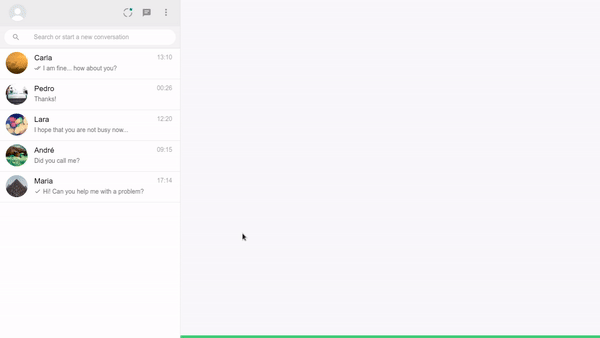

<div align="center">
    <br/>
    
    <br>
</div>

<br/>

# Whatsapp Clone

<br/>
 
This is a project made in ReactJS and NextJS. The main idea of the project was copy the Whatsapp web interface. I also created some example chats to simulate the chats in the application. To generate the profile pictures, i also get the pictures from the "picsum" website. This website generates a random profile picture in the size that you want.

It is worth mentioning that, when cloning the repository, it is necessary to use the ```yarn``` command to load the modules and configure the application. After that, just run the ```yarn dev``` command to launch the software on localhost.

<br/>
